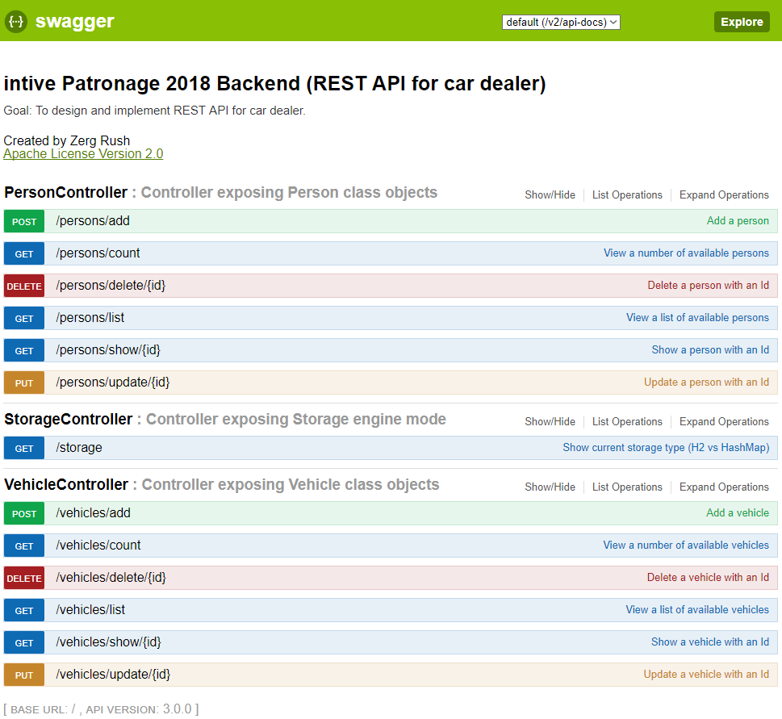
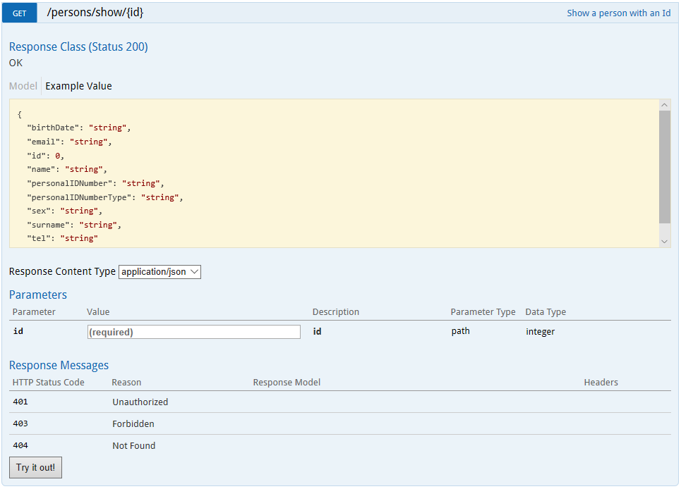

# Patronage 2018 / BACKEND
Goal: to design and implement REST API for car dealer
----------------------------------------------------

Data model
------------------------

Project structure
------------------------

Updated project structure with three brand new class-level validation constrains (for plate number, first registration and registration date) and Enum classes (for engine fuel type, gender and ID number type):

Designated Endpoints
--------------------
Swagger2 REST API specification file (available to download at [http://localhost:8080/v2/api-docs](http://localhost:8080/v2/api-docs))

Swagger2 (additional frontend component included in the project) generated doc:  
[http://localhost:8080/swagger-ui.html#/](http://localhost:8080/swagger-ui.html#/)

HAL browser (additional embedded browser included in the project, which provide basic UI for accessing REST API, https://github.com/mikekelly/hal-browser):

[http://localhost:8080/browser/index.html#/](http://localhost:8080/browser/index.html#/)

 
[http://localhost:8080/browser/index.html#/vehicles/show/1](http://localhost:8080/browser/index.html#/vehicles/show/1)

IntelliJ REST API assistant tool:  

Environment variable H2_STORAGE_ENABLED set to false in IntelliJ IDE (for tests):
--------------------------------------------------------------------------------

1) Simplest one with interner browser

[img] Browser.png

2) curl utility

[img] Windows command box with curl.png

[img] BASH command box with curl.png

[code box] testing class

[img] jakiś obrazek ilustrujący

All endpoints summary exposed by service
http://localhost:8080/v2/api-docs  
http://localhost:8080/swagger-resources/configuration/security  
http://localhost:8080/swagger-resources/configuration/ui  
http://localhost:8080/swagger-resources  
http://localhost:8080/error  
http://localhost:8080/metrics/{name:.*}  
http://localhost:8080/metrics || /metrics.json  
http://localhost:8080/heapdump || /heapdump.json  
http://localhost:8080/loggers/{name:.*}  
http://localhost:8080/loggers/{name:.*}  
http://localhost:8080/loggers || /loggers.json  
http://localhost:8080/autoconfig || /autoconfig.json  
http://localhost:8080/actuator || /actuator.json  
http://localhost:8080/trace || /trace.json  
http://localhost:8080/auditevents || /auditevents.json  
http://localhost:8080/configprops || /configprops.json  
http://localhost:8080/health || /health.json  
http://localhost:8080/dump || /dump.json  
http://localhost:8080/env/{name:.*}  
http://localhost:8080/env || /env.json  
http://localhost:8080/mappings || /mappings.json  
http://localhost:8080/beans || /beans.json  
http://localhost:8080/info || /info.json  
http://localhost:8080/webjars/**  
http://localhost:8080/**  
http://localhost:8080/**/favicon.ico  